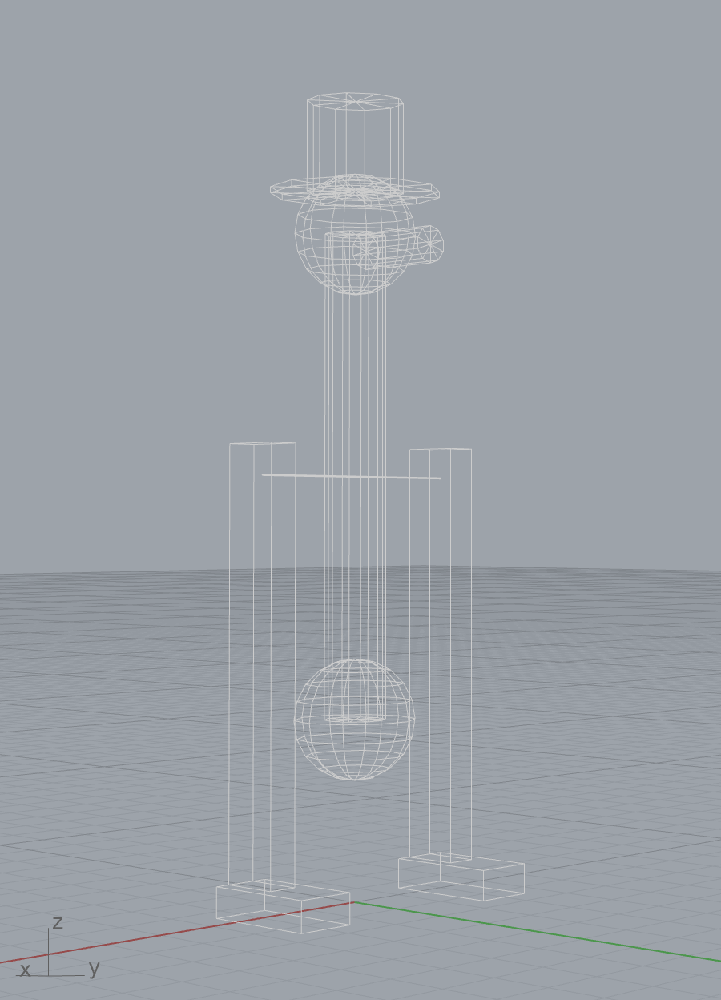

# Examples

## Animating a robot

Once a scene knows how to draw a robot, animating it is just calling
`update()` with a different configuration for each frame. There are two
common ways to do this in Blender, depending on whether you want the
motion baked into the timeline or driven live.

Both examples below pick two random configurations as the start and end
of the motion and linearly interpolate between them. Every run picks a
different pair of poses, so try them a few times to see a variety of
motions. The arm occasionally clips through itself because
`random_configuration()` samples uniformly within joint limits and
doesn't check for self-collision, but the animation pattern is the same
regardless of where the configurations come from.

=== "Keyframe baking in Blender"

    Bake one keyframe per frame onto Blender's timeline. After the script
    finishes, the animation lives in the `.blend` file and can be scrubbed,
    looped, or rendered to a video — no script needs to be running.

    ```python
    --8<-- "docs/files/animate_ur5e_keyframes.py"
    ```

=== "Using a timer in Blender"

    If you want the motion to happen *now*, while a script is running,
    without modifying the timeline, use `bpy.app.timers`. Each tick runs
    `update()` with a freshly interpolated configuration, and Blender
    repaints the viewport between ticks.

    ```python
    --8<-- "docs/files/animate_ur5e_timer.py"
    ```

=== "Using a self-updating component in Grasshopper"

    In Grasshopper, you can use `compas_ghpython.timer.update_component` to
    re-trigger a GhPython component after a specified interval. The example
    below updates the component every ~33 ms (approximately 30 fps) while
    the motion is in progress.

    ```python
    --8<-- "docs/files/animate_ur5e_grasshopper.py"
    ```

## Drinking bird

A more complete example showing how to build a robot model programmatically by
combining multiple links and joints. This produces a rough model of the classic
drinking bird toy:

```python
--8<-- "docs/files/drinking_bird.py"
```

